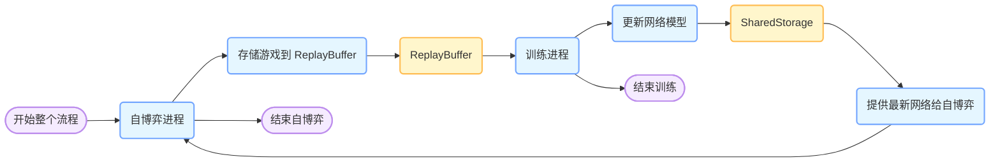
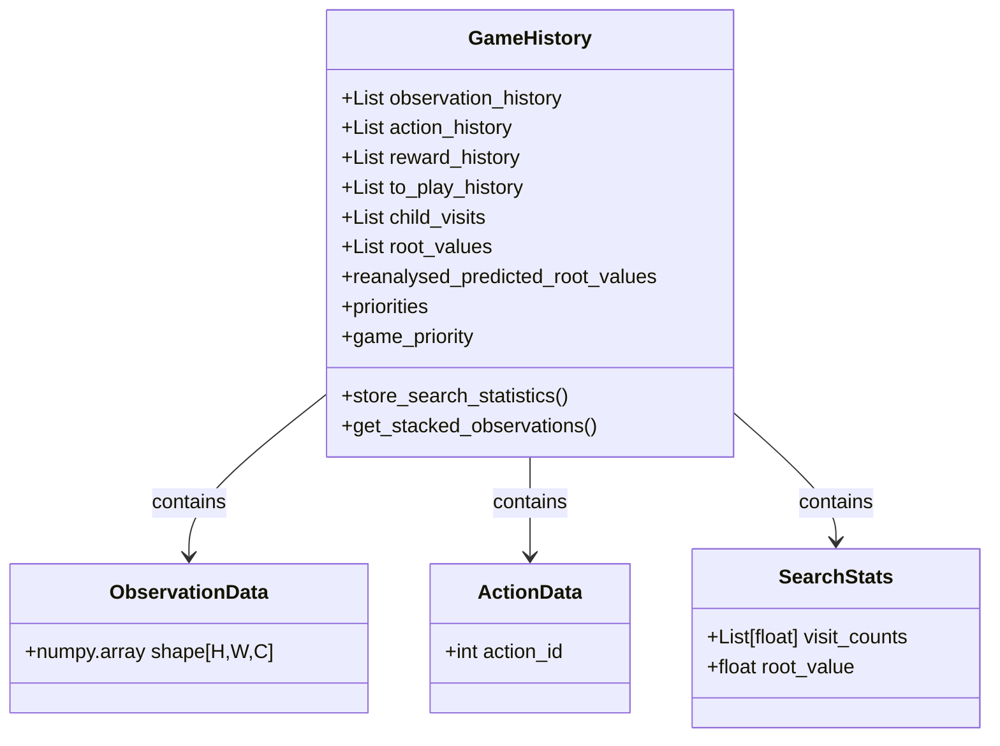
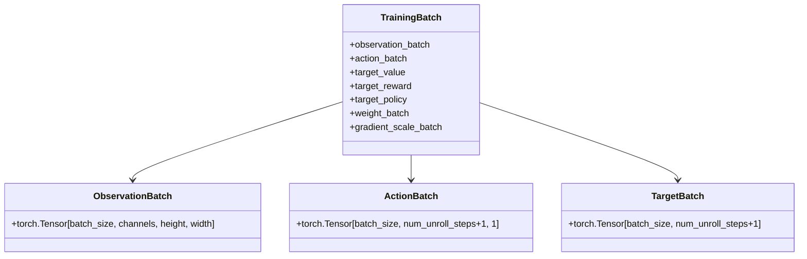
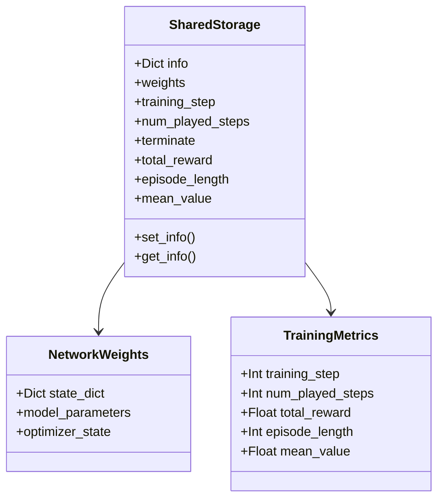
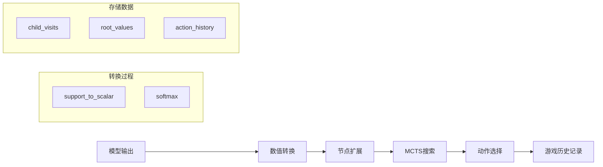
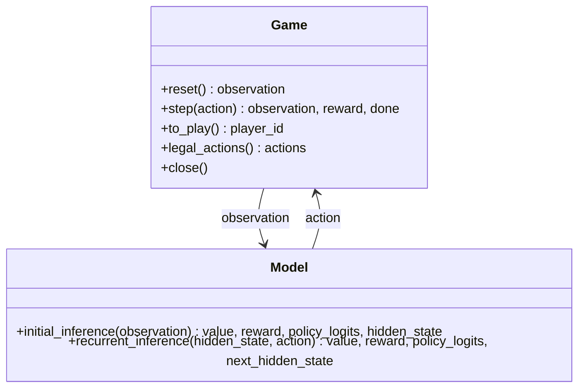

# 整体设计

MuZero 通过以下几个主要步骤实现强化学习训练循环：
共享存储（Shared Storage）：存放最新的神经网络权重参数。这是整个系统的参数中心，存储着当前最优的模型参数，为其他组件提供模型基础。
自我对弈（Self - Play）：从共享存储中加载最新的神经网络权重，然后利用这些权重来进行自我对弈。在对弈过程中，生成大量的对弈游戏数据，这些数据包含了不同状态、采取的行动以及相应结果等信息。自我对弈过程利用多个 CPU 并行加速，将生成的游戏历史数据存储到回放缓冲区（Replay Buffer）中。
回放缓冲区（Replay Buffer）：存储自我对弈生成的游戏数据。训练器（Trainer）会从回放缓冲区中获取训练批次数据，用于训练神经网络。
训练器（Trainer）：使用 GPU 从回放缓冲区获取训练数据批次，对神经网络进行训练。训练完成后，将更新后的模型权重保存回共享存储。如此循环，不断优化神经网络。

### 整体交互流程图
结合整体工作思路：
 - **共享存储**：`SharedStorage`类负责保存最新的神经网络权重，是整个系统中模型参数的存储中心 。
 - **自博弈**：`MuZeroConfig`类配置自博弈相关参数，`run_selfplay`函数不断从`SharedStorage`获取最新网络，通过`play_game`函数进行自博弈。`play_game`中利用`Game`类管理游戏进程，通过`run_mcts`执行蒙特卡洛树搜索，`run_mcts`中`Node`类构建搜索树，`ActionHistory`记录动作历史，搜索结束后选择动作并更新游戏状态，最终将游戏数据保存到`ReplayBuffer` 。
 - **训练**：`train_network`函数从`ReplayBuffer`采样游戏数据，利用`Network`类对神经网络进行训练，训练过程中计算损失并更新权重，训练后的网络模型再保存回`SharedStorage` 。如此循环，实现了从共享存储获取模型 -> 自博弈生成数据 -> 训练更新模型 -> 保存回共享存储的闭环。 


该流程图展示了自博弈和训练两部分的交互：自博弈进程 `Self - Play`生成游戏数据存储到 `ReplayBuffer` 中，训练进程`Trainer`从 `ReplayBuffer` 采样数据更新网络模型，更新后的模型存储在 `SharedStorage` 中，自博弈进程再从 `SharedStorage` 获取最新网络继续进行自博弈，如此循环，直到训练和自博弈结束。

# 数据模型
### ReplayBuffer

- 游戏存储数据模型

-基础游戏记录
self.observation_history = []  # 观察历史，每个元素是状态观察
self.action_history = []      # 动作历史，每个元素是选择的动作ID
self.reward_history = []      # 奖励历史，每个元素是获得的奖励值
self.to_play_history = []     # 玩家历史，记录每一步轮到哪个玩家

-MCTS搜索统计
self.child_visits = []        # 子节点访问统计，记录访问概率分布
self.root_values = []         # 根节点价值，记录每步的预测价值

-优先经验回放相关
self.priorities = None        # 样本优先级
self.game_priority = None     # 游戏整体优先级

- 输出给Trainer的数据模型

observation_batch: torch.Tensor  # [batch_size, channels, height, width]
action_batch: torch.Tensor       # [batch_size, num_unroll_steps+1, 1]
target_value: torch.Tensor       # [batch_size, num_unroll_steps+1]
target_reward: torch.Tensor      # [batch_size, num_unroll_steps+1]
target_policy: torch.Tensor      # [batch_size, num_unroll_steps+1, action_space_size]

weight_batch: torch.Tensor       # [batch_size]
gradient_scale_batch: torch.Tensor  # [batch_size, num_unroll_steps+1]

- num_unroll_steps 在 MuZero 算法中是一个重要的参数，表示在训练时展开（unroll）的步数
- weight_batch是用于优先经验回放(PER, Prioritized Experience Replay)的重要性采样权重，在训练时应用权重
- loss = loss * weight_batch  # 对每个批次样本的损失进行加权

- gradient_scale_batch 用于动态函数展开时的梯度缩放
- 在训练时应用梯度缩放 value_loss.register_hook(lambda grad: grad / gradient_scale_batch[:, step])

### Shared Storage 的数据结构

- 从训练器接收更新的权重
shared_storage.set_info.remote({
    "weights": model.get_weights(),
    "training_step": training_step
})

- 从自博弈进程接收游戏统计
shared_storage.set_info.remote({
    "episode_length": len(game_history.action_history) - 1,
    "total_reward": sum(game_history.reward_history),
    "mean_value": numpy.mean([value for value in game_history.root_values if value])
})

### Model 的数据结构
- 推理结构
```
graph TD
    subgraph 初始推理
        A[观察 Observation] --> B[表征网络 Representation]
        B --> C[编码状态 Encoded State]
        C --> D[预测网络 Prediction]
        D --> E1[策略 Policy]
        D --> E2[价值 Value]
    end

    subgraph 循环推理
        F[编码状态 Encoded State] --> G[动态网络 Dynamics]
        H[动作 Action] --> G
        G --> I[下一状态 Next State]
        G --> J[奖励 Reward]
        I --> K[预测网络 Prediction]
        K --> L1[策略 Policy]
        K --> L2[价值 Value]
    end
```
- 表征网络
self.representation_network = torch.nn.DataParallel(
    mlp(
        observation_shape[0] * observation_shape[1] * observation_shape[2] * (stacked_observations + 1)
        + stacked_observations * observation_shape[1] * observation_shape[2],
        fc_representation_layers,  # 隐藏层配置
        encoding_size,  # 输出维度
    )
)
- 输入 : 观察 [batch_size, H*W*C*(stacked_observations+1)]
- 输出 : 编码状态 [batch_size, encoding_size]

- 动态网络
self.dynamics_encoded_state_network = torch.nn.DataParallel(
    mlp(
        encoding_size + action_space_size,  # 状态和动作拼接
        fc_dynamics_layers,  # 隐藏层配置
        encoding_size,  # 输出维度
    )
)
self.dynamics_reward_network = torch.nn.DataParallel(
    mlp(encoding_size, fc_reward_layers, full_support_size)
)
- 输入 : 
-- 编码状态 [batch_size, encoding_size]
-- 动作 [batch_size, action_space_size]
- 输出 :
-- 下一状态 [batch_size, encoding_size]
-- 奖励 [batch_size, full_support_size]

- 预测网络
self.prediction_policy_network = torch.nn.DataParallel(
    mlp(encoding_size, fc_policy_layers, action_space_size)
)
self.prediction_value_network = torch.nn.DataParallel(
    mlp(encoding_size, fc_value_layers, full_support_size)
)
- 输入 : 编码状态 [batch_size, encoding_size]
- 输出 :
-- 策略 [batch_size, action_space_size]
-- 价值 [batch_size, full_support_size]

#### 保持训练稳定性
- 将编码状态归一化到[0,1]区间，提高训练稳定性
- 使用分类方式表示价值和奖励
- torch.nn.DataParallel  # 所有网络都支持数据并行

#### 推理
- 初始推理
```
def initial_inference(self, observation):
    encoded_state = self.representation(observation)
    policy_logits, value = self.prediction(encoded_state)
    reward = torch.zeros(...)  # 初始奖励为0
    return value, reward, policy_logits, encoded_state
```
- 循环推理
```
def recurrent_inference(self, encoded_state, action):
    next_encoded_state, reward = self.dynamics(encoded_state, action)
    policy_logits, value = self.prediction(next_encoded_state)
    return value, reward, policy_logits, next_encoded_state
```

#### 推理输出在game中使用
```
# MCTS 搜索中的循环推理
value, reward, policy_logits, hidden_state = model.recurrent_inference(
    parent.hidden_state,
    torch.tensor([[action]]).to(parent.hidden_state.device),
)

# 处理输出
value = models.support_to_scalar(value, self.config.support_size).item()
reward = models.support_to_scalar(reward, self.config.support_size).item()

# 用于节点扩展
node.expand(
    self.config.action_space,
    virtual_to_play,
    reward,
    policy_logits,
    hidden_state,
)
```
- 模型到game输出的转换


### Game 的数据结构

- Game 到 Model
```
# 游戏状态
observation = self.game.reset()  # [H, W, C]
observation, reward, done = self.game.step(action)

# 游戏控制信息
legal_actions = self.game.legal_actions()  # List[int]
to_play = self.game.to_play()  # int

# 初始推理
observation = torch.tensor(observation).float().unsqueeze(0)  # [1, H, W, C]
value, reward, policy_logits, hidden_state = model.initial_inference(observation)

# 循环推理
action_tensor = torch.tensor([[action]])  # [1, 1]
value, reward, policy_logits, next_hidden_state = model.recurrent_inference(hidden_state, action_tensor)
```
- Game到ReplayBuffer
```
# 游戏历史记录
game_history = GameHistory()
game_history.observation_history.append(observation)  # [H, W, C]
game_history.action_history.append(action)  # int
game_history.reward_history.append(reward)  # float
game_history.to_play_history.append(to_play)  # int

# MCTS搜索统计
game_history.store_search_statistics(root, action_space)
# - child_visits: List[float] - 访问计数分布
# - root_values: List[float] - 根节点价值

# 保存游戏历史
replay_buffer.save_game.remote(game_history, shared_storage)
```

